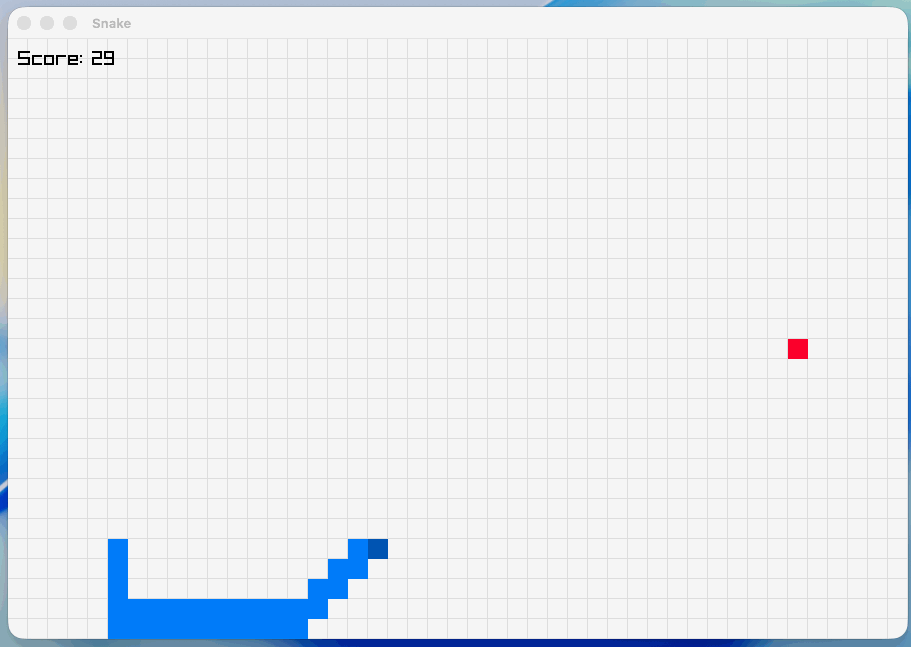

# Snake AI

Snake AI is a reinforcement learning project that combines:
- A C Snake engine (with raylib rendering)
- A Python DQN agent (PyTorch)



## Installation

1. Install raylib (with `pkg-config` support):
[raylib build and installation docs](https://github.com/raysan5/raylib?tab=readme-ov-file#build-and-installation)
2. Install Python 3.14+
3. Install project Python dependencies: `torch`, `numpy`, `matplotlib` (I used `uv` for this project)
4. Clone this repository

## Usage

### 1. Build the native playable game (C)

```bash
./build.sh game
```

Run it:

```bash
./build/snake
```

Controls:
- Right: `0` action internally (`→` key)
- Left: `1` action internally (`←` key)
- Up: `2` action internally (`↑` key)
- Down: `3` action internally (`↓` key)

### 2. Build the shared engine for Python

```bash
./build.sh engine
```

This generates:

```text
build/libsnake.so
```

### 3. Run Python engine test environment

```bash
python3 src/python_ai/test_env.py
```

### 4. Run C engine tests

```bash
./build.sh test
```

### 5. Train the DQN agent

```bash
python3 src/python_ai/training.py
```

Training saves weights to:

```text
model/snake_dqn.pt
```

### 6. Watch the trained agent play

Make sure `model/snake_dqn.pt` exists, then run:

```bash
python3 src/python_ai/play.py
```

## Build script modes

`build.sh` supports three modes:

```bash
./build.sh game
./build.sh engine
./build.sh test
```

If no mode is provided, it defaults to `game`.

## Platform notes

### Linux or macOS

If raylib is available through `pkg-config`, the commands above should work directly.

### Other platforms / setups

If `pkg-config`-based build fails (common on Windows or custom raylib installs), build manually with your preferred toolchain (for example CMake or an IDE), and ensure Python can load the produced shared library.

See raylib platform-specific guidance:
[raylib build and installation docs](https://github.com/raysan5/raylib#build-and-installation)

## Project structure

```text
snake-ai/
├── build.sh
├── model/
│   └── snake_dqn.pt
├── src/
│   ├── engine/
│   │   ├── engine.c
│   │   ├── engine.h
│   │   └── main.c
│   └── agent/
│       ├── model.py
│       ├── play.py
│       ├── snake_env.py
│       ├── test_env.py
│       └── training.py
├── raymath.h
├── pyproject.toml
└── README.md
```
